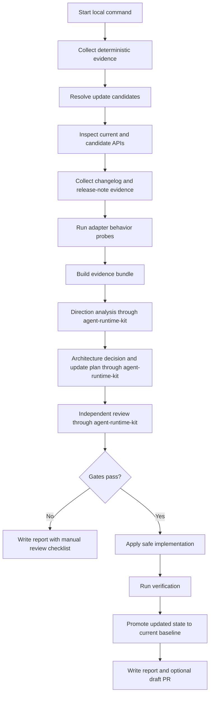
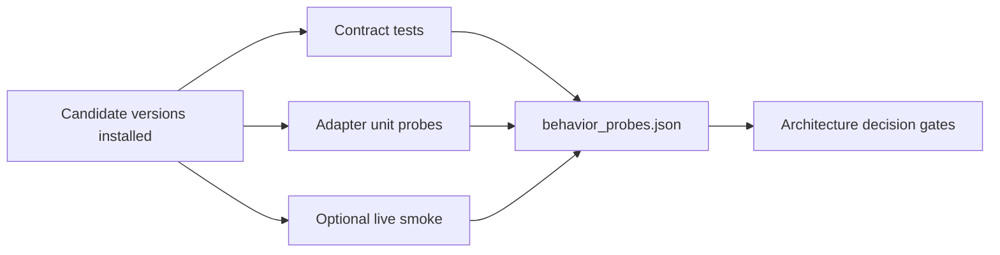
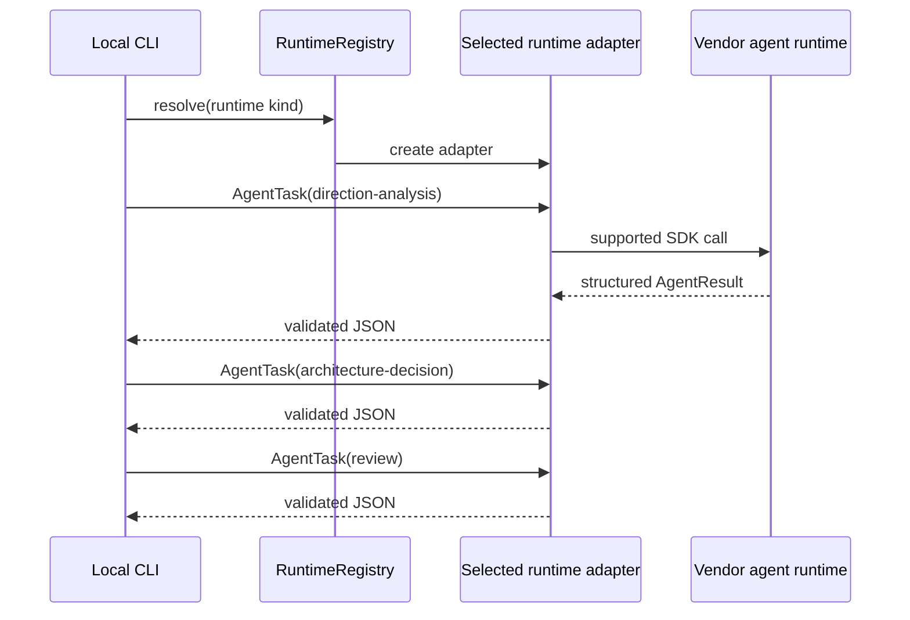
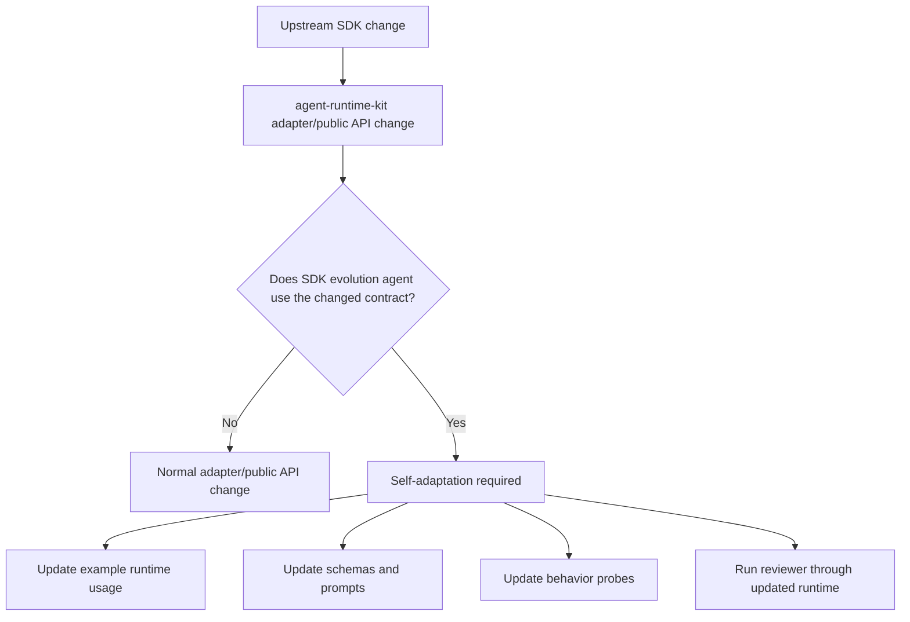

# SDK Evolution Agent Design

This document describes how the SDK evolution example should work before adding
more implementation. It is intentionally more detailed than the user-facing run
guide in `docs/sdk-evolution-agent.md`.

The core idea is that a dependency update is not enough evidence. The agent
must combine resolver facts, release notes, API shape, adapter behavior probes,
and real-runtime review before it recommends a lockfile change, adapter change,
or manual design stop.

## Goals

The SDK evolution agent should answer these questions for every run:

- What package versions are installed, locked, and available upstream?
- Which packages does the resolver actually want to update?
- What changed in public API shape?
- What changed in documented behavior or product direction?
- Which adapter behavior contracts still pass on the candidate versions?
- Does the current `agent-runtime-kit` abstraction still preserve vendor
  behavior?
- Is the safe next action a lock update, adapter update, docs/test update,
  provider-specific extension, public API evolution, or manual design review?

The agent must dogfood `agent-runtime-kit`: all AI reasoning stages run through
`AgentTask`, `RuntimeRegistry`, runtime adapters, output schemas, event sinks,
permission profiles, and `AgentResult`. Local shell, filesystem, package
manager, Git, and GitHub operations are allowed only for deterministic evidence
collection and mechanical changes.

## Non-Goals

The example should not become a generic dependency update bot. A generic bot
can answer "can the lockfile move?" This agent must answer "does the runtime
adapter contract still hold, and does the public SDK architecture still make
sense?"

It should not hide vendor differences. If Claude adds task status events, Codex
changes sandbox semantics, or Antigravity changes model endpoint configuration,
the right output is explicit provider-specific evidence and possibly a
provider-specific extension, not a flattened common denominator.

It should not require all vendor SDKs for normal package users. The example can
use `agent-runtime-kit[all]` for local research, but the package itself must keep
optional extras.

## High-Level Flow



Step responsibilities:

- **Start local command**: Parse the selected runtime, package filters, report
  directory, refresh options, implementation flag, branch option, and draft PR
  option. This step also establishes the run ID and local report directory.
- **Collect deterministic evidence**: Read local project state without using AI:
  `pyproject.toml`, `uv.lock`, installed distributions, package metadata,
  configured source hints, local environment facts, and supported auth
  availability. This produces raw facts, not recommendations.
- **Resolve update candidates**: Run the targeted resolver preview with
  freshness cutoffs removed. This step decides which packages are real update
  candidates for the run. It should use resolver output rather than only PyPI
  `latest` metadata, especially for prerelease packages.
- **Inspect current and candidate APIs**: Load API snapshot and diff artifacts
  from the last update run, then focus new inspection on packages that the
  resolver selected for update or packages whose evidence is missing, stale, or
  incompatible with the current evidence schema. This step owns API snapshot and
  API diff artifacts. If the evidence signature changes, the agent may need to
  refresh the current-state snapshot or gather more current-state data before
  comparing candidates. If an update candidate has no candidate API diff, the
  run should not proceed to implementation.
- **Collect changelog and release-note evidence**: Fetch or read official
  changelogs, release pages, docs changelogs, repository releases, and package
  metadata links. This step records what changed according to the vendor and
  explicitly marks missing or incomplete release-note coverage.
- **Run adapter behavior probes**: Execute deterministic unit probes, installed
  SDK contract probes, and optional live probes. This step answers whether the
  adapter behavior still holds, including permissions, sandbox/workspace
  handling, streaming, structured output, MCP/tool support, auth discovery, and
  session/resume behavior.
- **Build evidence bundle**: Normalize package facts, resolver facts, API
  snapshots, API diffs, release-note evidence, behavior probe results, source
  references, and uncertainty into a compact bundle for the AI stages. This step
  should preserve provenance so later reasoning can be traced back to evidence.
- **Direction analysis through agent-runtime-kit**: Ask a runtime, via
  `AgentTask`, to infer direction-of-travel themes from the evidence. This step
  identifies whether changes look isolated or part of a broader SDK direction,
  but it does not own the concrete implementation plan.
- **Architecture decision and update plan through agent-runtime-kit**: Ask a
  runtime, via `AgentTask`, to turn direction analysis into the concrete plan:
  adapter-only, test-only, docs-only, capability metadata change,
  provider-specific extension, public API evolution, compatibility shim,
  deprecation/migration, architectural rework, or `manual_design_required`.
  This is the step responsible for saying what should be updated.
- **Independent review through agent-runtime-kit**: Run a separate reviewer task
  through the runtime. The reviewer challenges evidence sufficiency, direction
  inference, plan scope, vendor-specific capability preservation, and whether
  tests, docs, and migration notes match the proposed change.
- **Gates pass?**: Apply deterministic pass/fail rules. The gates block
  implementation when required API diffs are missing, release-note coverage is
  missing, behavior probes fail or are skipped for required contracts, the
  reviewer rejects the plan, recursive self-adaptation is unresolved, or manual
  design is required.
- **Write report with manual review checklist**: If gates fail, write the local
  report with the evidence bundle, analysis, decision, reviewer output,
  uncertainty, blocked reasons, and the exact manual review questions. This is a
  valid end state, not a failed run.
- **Apply safe implementation**: Apply only the changes allowed by the accepted
  architecture decision and deterministic gates. This may include lockfile
  updates, adapter changes, tests, docs, examples, compatibility shims, or report
  changes. It must not implement changes that were classified as
  `manual_design_required`.
- **Run verification**: Run the verification commands required by the
  architecture decision. At minimum, this should cover formatting/linting,
  typing, unit tests, lock checks, report generation checks, and any available
  live smoke needed for the affected runtime behavior.
- **Promote updated state to current baseline**: After implementation and
  verification pass, save the updated lock/package/API/release-note/probe state
  as the new current-state baseline for the next run. This promotion should be
  explicit, atomic, and tied to the verified commit or workspace state. Failed,
  blocked, or manual-design-required runs must not replace the current baseline.
- **Write report and optional draft PR**: Write the final local report with
  evidence, decisions, implementation summary, baseline-promotion result, test
  results, uncertainty, and manual checklist. If explicitly configured and
  authenticated, create or update a draft PR. This step must never auto-merge.

Every box before direction analysis is deterministic. AI stages may interpret
evidence, but they should not invent evidence that was not collected.

## Operating Modes

The default command should be report-only:

```bash
python -m examples.sdk_evolution_agent --runtime fake --refresh-preview
```

This mode collects evidence, writes artifacts, runs the analysis stages through
the selected runtime, and stops before editing the workspace. The fake runtime is
allowed only as a deterministic development harness. It proves the pipeline and
schemas, not the quality of AI reasoning.

A real analysis run should select one configured runtime:

```bash
python -m examples.sdk_evolution_agent --runtime claude-agent-sdk --refresh-preview
python -m examples.sdk_evolution_agent --runtime codex-agent-sdk --refresh-preview
python -m examples.sdk_evolution_agent --runtime antigravity-agent-sdk --refresh-preview
```

When `codex-agent-sdk` is selected for SDK update work, every AI-backed stage
should run on `gpt-5.5` with `reasoning_effort=xhigh`. This is a Codex runtime
policy, not a portable metadata field: Claude and Antigravity runs should not
receive a `gpt-5.5` model override.

Package filters narrow evidence collection for debugging, but normal evolution
runs should inspect all tracked packages:

```bash
python -m examples.sdk_evolution_agent \
  --runtime antigravity-agent-sdk \
  --refresh-preview \
  --package claude-agent-sdk \
  --package openai-codex \
  --package openai-codex-cli-bin \
  --package google-antigravity
```

`--inspect-candidates` should be effectively always on. The CLI can keep the
flag for compatibility, but update candidates without candidate API snapshots
are not actionable.

Implementation mode should remain explicitly gated:

```bash
python -m examples.sdk_evolution_agent \
  --runtime antigravity-agent-sdk \
  --refresh-preview \
  --implementation-enabled
```

Even in implementation mode, deterministic gates decide whether edits are
allowed. Draft PR creation is separate and should only happen when the local Git
and GitHub environment is authenticated and explicitly configured with
`--draft-pr`.

## Evidence Layers

The report should clearly separate evidence layers. Mixing them together is how
bad conclusions slip in.

### 1. Package and Resolver Evidence

The agent checks:

- `pyproject.toml` dependency declarations.
- `uv.lock` versions.
- Installed distributions in the local environment.
- PyPI metadata and recent releases.
- `uv lock --dry-run -P ...` output with freshness cutoffs removed.

`uv lock --dry-run` is the source of truth for update candidates when it is
available. PyPI `latest` metadata is useful context, but it can be misleading
for prerelease packages. For example, a locked prerelease can be newer than the
stable value reported by package metadata.

### 2. API Shape Evidence

The agent should treat the lockfile as the current SDK baseline. If the active
Python environment has drifted from `uv.lock`, the agent inspects the locked
baseline in an isolated virtualenv instead of using the installed package. API
inspection artifacts are reusable evidence from the last update run when their
schema, lockfile version, and artifact hashes still match. A normal run starts
by loading the prior `api_snapshots/` and `api_diffs.json` artifacts, then
inspects only the packages that need fresh facts:

- packages selected by the resolver for update,
- packages whose prior artifacts are missing,
- packages whose prior artifacts were produced by an older evidence schema,
- packages whose current locked or installed version no longer matches the
  artifact baseline,
- packages needed to answer a specific adapter-compatibility question.

For importable packages, snapshots record:

- public member names,
- member kind,
- signature where Python introspection can provide one,
- defining module,
- import errors.

This catches obvious adapter risks:

- removed classes or functions,
- changed constructor signatures,
- changed enum or model surfaces,
- new provider-specific capabilities worth exposing.

API shape is necessary but insufficient. It does not prove behavior.

After a successful implementation, the candidate API snapshots and diffs that
were verified must be promoted to the current-state baseline. That ensures the
next run compares new upstream candidates against the SDK state that was
actually accepted, not against stale pre-update artifacts.

If the evidence schema changes, promotion should include a schema refresh of the
current package state even when the package version did not change. Otherwise
future runs may compare candidate evidence against artifacts that no longer mean
the same thing.

### 3. Changelog and Release-Note Evidence

The agent should collect release-note context when a vendor publishes it.

| Package | Preferred source | Why it matters |
| --- | --- | --- |
| `claude-agent-sdk` | Python SDK `CHANGELOG.md` and Claude Agent SDK docs | Claude often ships behavioral changes around task progress, sessions, tools, permissions, and model support. |
| `openai-codex` | Codex SDK docs, Codex changelog, and `openai/codex` releases | Codex changes can involve sandboxing, working directories, remote execution, app-server behavior, and SDK maturity. |
| `openai-codex-cli-bin` | `openai/codex` releases and package metadata | The binary package is runtime infrastructure, so behavior can change even when the Python SDK surface does not. |
| `google-antigravity` | Antigravity changelog, repository, package metadata, examples, and public API snapshots | Antigravity release context may be product-level instead of package-version-specific, so the agent must preserve source coverage and uncertainty separately. |

The report should preserve source references and a short excerpt or summary. If
release notes are unavailable, that absence is evidence and should increase
uncertainty.

Primary sources should be recorded with URLs in `release_notes.json`:

- `claude-agent-sdk`: `https://github.com/anthropics/claude-agent-sdk-python/blob/main/CHANGELOG.md`
- Claude Agent SDK docs: `https://code.claude.com/docs/en/agent-sdk/overview`
- Codex SDK docs: `https://developers.openai.com/codex/sdk`
- Codex changelog: `https://developers.openai.com/codex/changelog`
- Codex repository releases: `https://github.com/openai/codex/releases`
- Antigravity changelog: `https://antigravity.google/changelog`
- Antigravity repository: `https://github.com/google-antigravity/antigravity-sdk-python`

If a package has no release-note source for the exact version interval, the
agent should still record what it checked and why the source was insufficient.
Fetched official sources with no package-version-specific entry are evidence
with explicit uncertainty; they are not the same as a collection failure.

### 4. Behavior Probe Evidence

Behavior probes test what signatures cannot show. They should be deterministic
where possible and optional-live where credentials are required.



Behavior probes should cover these contracts:

| Contract | Why API diffs are not enough | Example probe |
| --- | --- | --- |
| Request construction | Constructor signatures can stay stable while fields change meaning. | Assert adapter builds expected SDK options/config objects. |
| Permission mapping | Permission mode names can stay present while policy behavior changes. | Strict/default/permissive tests for each adapter. |
| Sandbox and workspace semantics | Behavior can shift across SDK or CLI layers without a Python signature change. | Codex sandbox enum and run argument contract tests, plus smoke where possible. |
| Streaming and event order | New message types may not break imports but may be dropped. | Feed fake vendor messages and assert emitted event order. |
| Structured output | Schema fields can exist but runtime may return prose or tool calls. | Live or fake structured-output task with schema validation. |
| Session/resume | Resume options can exist but behavior may change. | Fake SDK request shape plus optional live resume smoke. |
| MCP/tool support | MCP config may move from one module to another without a simple signature break. | Adapter MCP config tests and unsupported-feature assertions. |
| Auth discovery | Supported auth sources differ by vendor and may change independently. | Availability probes that report source without scraping credentials. |

Behavior probe output should be a first-class report artifact, for example:

```text
behavior_probes.json
behavior_diffs.json
```

Each probe result should include:

- probe name,
- relevant package or adapter,
- command or test function,
- pass/fail/skip status,
- stdout/stderr summary,
- skipped reason when optional credentials are missing.

`behavior_diffs.json` compares current-environment probes against
candidate-version probes for resolver-selected updates. Breaking candidate probe
changes block implementation deterministically before any local lock update.

`behavior_probes.json` may include observed SDK fields or parameters that are
not part of the adapter contract. `behavior_diffs.json` compares the required
adapter contract, not every optional field. Public API and signature churn
remains visible in `api_diffs.json` and probe details, but it should only block
implementation when the required behavior contract fails or becomes ambiguous.

### 5. Runtime-Generated Analysis

After deterministic evidence is collected, the AI stages can interpret it:



The AI stages should receive compacted, source-referenced evidence. They should
not be asked to inspect the filesystem directly during report-only analysis.

## Decision Gates

The agent should fail closed. Implementation is blocked when:

- the resolver reports an update but candidate API diffs are missing,
- release notes exist but were not collected,
- release notes are unavailable and the API or behavior evidence is ambiguous,
- behavior probes fail,
- behavior probes are skipped for a contract that is required for the proposed
  implementation,
- the reviewer rejects the evidence or architecture decision,
- `manual_design_required` is true,
- recursive self-adaptation is required but no migration plan exists.

An empty API diff can be valid. A missing API diff for an update candidate is
not valid.

## Recursive Self-Adaptation

The SDK evolution agent uses `agent-runtime-kit` to update `agent-runtime-kit`.
That makes runtime-layer changes recursive.



If a change affects `AgentTask`, `AgentResult`, `RuntimeRegistry`, runtime
adapters, output schemas, event sinks, permission profiles, or typed unsupported
feature errors, the report must call this out explicitly.

## Changelog Source Strategy

The agent should prefer official and primary sources:

- package repository changelog files,
- official release pages,
- official docs changelog pages,
- package metadata links,
- repository releases.

It should not scrape private credentials or authenticated browser sessions to
obtain changelogs. If a source requires authentication, the report should mark
that source unavailable and explain the limitation.

For `claude-agent-sdk`, the Python changelog should be checked first. Claude
Code and Agent SDK docs are useful supplemental direction-of-travel sources.

For `openai-codex`, the Codex SDK docs and Codex changelog should be checked.
The `openai/codex` release page is also relevant because the Python SDK depends
on a bundled or pinned runtime.

For `google-antigravity`, if the official changelog or repository does not have
a package-version-specific entry, the agent should not pretend the source is
complete. It should compensate with package metadata, examples, API snapshots,
adapter contract tests, and live smoke where credentials are available.

## Behavior Probe Strategy

Behavior probes should be split into three tiers.

### Tier 1: Always-On Unit Probes

These use fake SDK objects and do not require credentials. They should run in
normal CI.

Examples:

- Claude request shape and stream translation tests.
- Codex approval mode, sandbox, thread item, and tool audit tests.
- Antigravity permission/tool/MCP config tests.
- unsupported-feature errors for non-portable options.

### Tier 2: Installed SDK Contract Probes

These introspect real installed SDK packages but do not call models.

Examples:

- `ClaudeAgentOptions` still accepts fields the adapter builds.
- `openai_codex.AsyncThread.run` still exposes expected parameters.
- `google.antigravity.LocalAgentConfig` still exposes expected config fields.

These are stronger than raw public snapshots because they encode adapter
assumptions.

### Tier 3: Optional Live Probes

These use local supported credentials and must never scrape credentials.

Examples:

- Claude one-turn smoke if Claude auth is configured.
- Codex one-turn smoke using provider-owned local auth.
- Antigravity structured-output smoke using API key or Google Application
  Default Credentials.

Live probes should be reported as pass/fail/skip. A skipped live probe should
not automatically block a docs-only or test-only change, but it should increase
uncertainty for runtime behavior changes.

## Report Shape

The report directory should include:

```text
config.json
evidence.json
release_notes.json
api_snapshots/
api_diffs.json
behavior_probes.json
behavior_diffs.json
current_state.json
direction_analysis.json
architecture_decision.json
implementation_summary.json
review.json
events.jsonl
report.md
```

`report.md` should summarize:

- package and resolver status,
- release-note coverage,
- API diff count and affected packages,
- behavior probe status,
- current-state baseline promotion status,
- direction-of-travel themes,
- architecture decision,
- reviewer status,
- implementation result,
- uncertainty and manual review checklist.

`current_state.json` should be the manifest that makes the next run
artifact-aware. It should record:

- evidence schema version,
- generated timestamp,
- source run ID,
- commit SHA or explicit dirty-worktree marker,
- lockfile hash,
- package names and accepted current versions,
- paths or content hashes for current API snapshots,
- paths or content hashes for release-note evidence,
- paths or content hashes for behavior probe results,
- whether the baseline was promoted, refreshed, skipped, or blocked.

Promotion rules should be conservative:

- promote only after implementation and verification pass,
- do not promote failed, blocked, report-only, or manual-design-required runs as
  the new current state,
- preserve the previous baseline so a bad promotion can be inspected,
- refresh the current-state baseline when the evidence schema changes, even if
  package versions did not change,
- make the final report say exactly which artifacts became the new baseline.

## Caveats and Concerns

Changelogs are incomplete. They often omit small behavior changes and may lag
package releases.

API snapshots are shallow. Python introspection can miss behavior encoded in
runtime binaries, generated models, callbacks, subprocesses, environment
variables, or remote services.

Live probes are environment-sensitive. They prove that one local credential and
runtime setup worked at one time. They do not replace unit or contract probes.

AI review can be overconfident or overcautious. The reviewer should challenge
evidence quality, but deterministic gates should own pass/fail decisions for
missing diffs, failed probes, and missing required release-note evidence.

Provider release cadence differs. Claude may expose rich changelogs. Codex may
split behavior between SDK docs, changelog, GitHub releases, and CLI runtime.
Antigravity may expose less written release context.

Prerelease handling matters. Resolver output should drive update candidates
because package metadata `latest` can point to a stable release while the lock
already contains a newer prerelease.

## Alternatives Considered

### API Diffs Only

Rejected. API diffs catch import and signature drift, but they do not prove
behavioral compatibility. This is the current weak point.

### Changelogs Only

Rejected. Changelogs are useful direction evidence, but they are not complete
and cannot prove local adapter behavior.

### Run Full Live Agents For Every Provider Every Time

Rejected as the default. It is too credential-dependent and would make local
runs brittle. Live probes should be optional and reported clearly.

### Dependabot-Style Lock Updates

Rejected. The goal is architectural evolution, not generic dependency freshness.
The agent must reason about provider-specific runtime capabilities and adapter
contracts.

### Lowest-Common-Denominator Runtime Abstraction

Rejected. The package exists to provide a clean Python API while preserving
vendor-specific capabilities, not to erase them.

### Separate Agents Per Provider Only

Partially useful but not sufficient. Provider-specific probes are valuable, but
the top-level agent still needs a cross-provider architecture view so public API
changes do not accidentally favor one runtime and flatten another.

## Implemented Artifact Contract

The example implements the deterministic evidence artifacts described above:

- `release_notes.json` records official source checks and whether matching
  version evidence was found, missing, or unavailable.
- `behavior_probes.json` records current and candidate adapter-contract probes.
- `behavior_diffs.json` records behavior differences between current and
  candidate probes.
- `current_state.json` records the run baseline, lockfile hash, accepted
  package versions, artifact hashes, and promotion status.

The implementation path is gated by deterministic checks before the local
lockfile update runs. Missing candidate API diffs, unavailable required
release-note evidence, breaking behavior diffs, reviewer rejection,
`manual_design_required`, and unresolved recursive self-adaptation all block
implementation. When implementation is allowed, the example applies the
resolver-selected SDK lock update locally, runs verification, writes the report
artifacts, commits them, pushes the branch, and opens a draft PR when configured.
